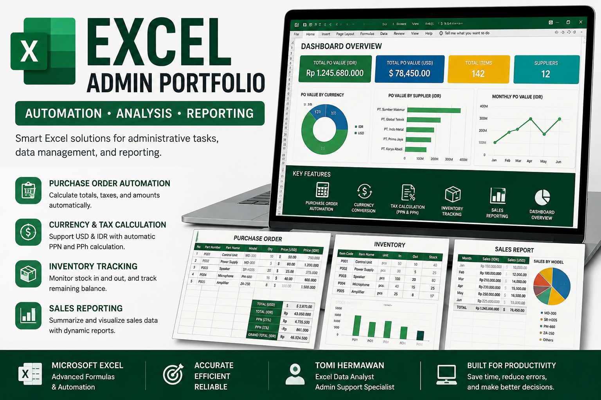

# 📊 Excel Admin Automation Portfolio

## 🚀 Overview
This project showcases an Excel-based administrative system designed to automate business processes such as purchase orders, inventory tracking, and reporting.

## 🔧 Features
- Purchase Order Automation
- Currency Conversion (USD & IDR)
- Tax Calculation (PPN & PPh)
- Inventory Tracking
- Sales Reporting Dashboard

## 🛠 Tools Used
- Microsoft Excel
- Advanced Formulas
- Data Analysis

## 📁 File Included
- Excel-Admin-Automation-Portfolio.xlsx

## 💼 Author
Tomi Hermawan  
Excel Data Analyst | Admin Support
